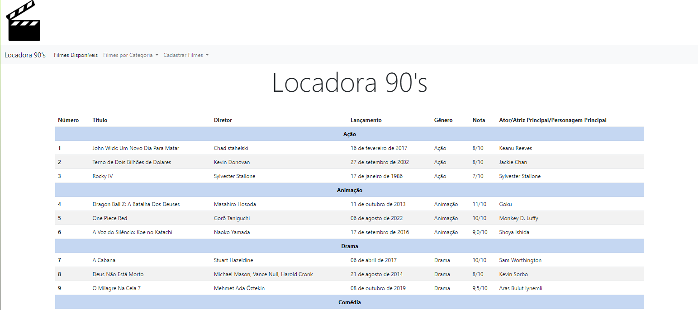
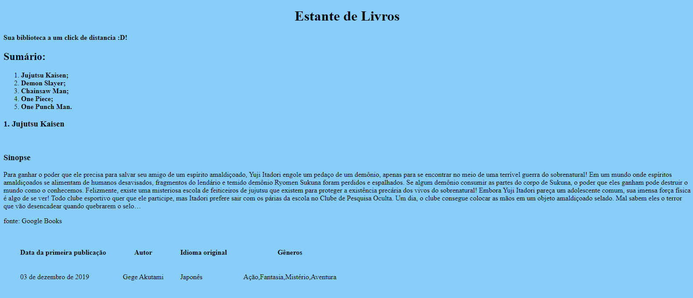

# TrabalhoFinal
# Projeto Portfólio

## Estrutura básica

 
	O site foi desenvolvido em HTML, CSS e JavaScript usando o Framework Bootstrap, aplicando alguns estilos visuais customizados.

Menu: Foi algo relativamente fácil de se fazer.

Cabeçalho: Uma imagem que resume a página.

Sobre: Dados sobre o programador.

Serviços/Habilidades: Foram colocadas as experiências do programador. 

Portfólio: Miniaturas com link diretórios a imagem

Contato: acesso a redes sociais e comunicação

  

## Glassmorphism

 É uma técnica geralmente usada em layouts de sites. Como pode-se observar, com isto, a foto fica fosca.
	

  
  

  

## Conheça outros projetos

 

  
  
  
  

 Maecenas est diam, lacinia vitae lacus eget, tempor hendrerit neque. Sed diam ligula, eleifend vel volutpat sed, tempus in sapien. Cras a ornare nulla, a malesuada lectus. Suspendisse potenti. Maecenas mollis dui id accumsan faucibus.

<a align="center" href="https://github.com/ProfTau" target="_blank">  link de alguma coisa</a>

